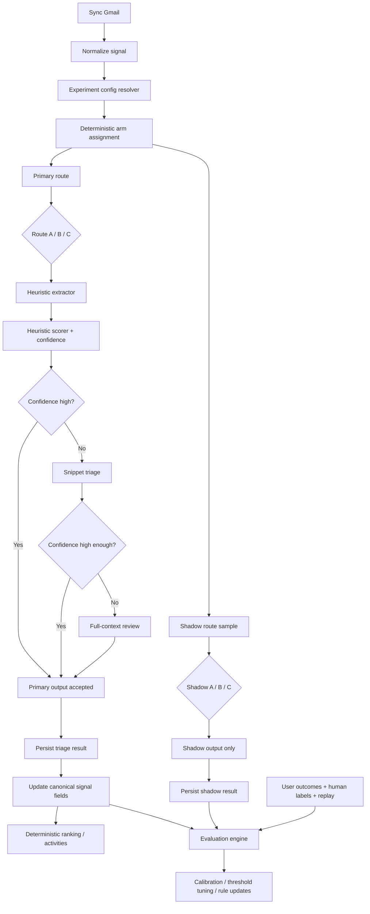

# Cost Reduction Plan

## Objective
Introduce a hidden experimentation framework and a cost-optimized triage pipeline for Gmail signals:

- route `A`: `heuristic -> snippet -> full`
- route `B`: `snippet -> full`
- route `C`: `full`

while preserving the product claim:
- every email is evaluated

and enabling:
- cost control
- accuracy measurement
- heuristic optimization
- ranking quality comparison
- safe rollout

## System Admin Dashboard

All analytics, evaluation, experiment controls, and budget monitoring live in the **System Admin** page (`/admin`), visible only to users with `is_admin = true` on their profile.

Current admin: `michal.pilawski@gmail.com`

### Current (Phase 0)
- LLM usage summary stats (total calls, cost, input/output tokens, user count)
- Daily cost bar chart (last 30 days)
- Cost breakdown by operation (classify, cluster, extract, chat, draft)
- Cost breakdown by model (Haiku vs Sonnet)
- Extraction retry monitor (stuck work objects, failed extractions)

### Phase 3 additions (Experiment Framework)
- Experiment config editor (create/enable/disable experiments)
- Arm assignment viewer (which users are on which arm)
- Shadow routing toggle and sample rate control
- Route result comparison table

### Phase 5 additions (Evaluation & Calibration)
- Heuristic vs LLM agreement rate
- Route A/B/C quality comparison dashboard
- Disagreement mining queue
- Confidence threshold tuning sliders
- Replay controls (rerun dataset on new heuristic version)

### Phase 7 additions (Budget Controls)
- Per-user daily spend chart
- Per-feature cost caps (configurable)
- Anomaly detection alerts
- Budget mode toggle (soft cap vs hard cap)
- Route C usage monitor and alerts

## Implemented Optimizations (Phases 0–2)

### Phase 0: Guardrails And Baseline (DONE)

**Goal:** Stabilize measurement before changing behavior.

**Deliverables:**
- [x] persisted AI usage events (`llm_usage` table + instrumented all LLM calls)
- [x] admin role and System Admin dashboard (`is_admin` flag, `/admin` page)
- [x] bug fix: infinite extraction retry loop (capped at 3 attempts)
- [x] bug fix: scoring cron over-trigger (only users with unlinked signals)
- [x] bug fix: chat history truncation (sliding window of 20 messages)
- [x] prompt trimming (removed redundant fields, truncated snippets)
- [ ] experiment config model (deferred to Phase 3)
- [ ] route result storage (deferred to Phase 3)

### Phase 1: Deterministic Activity Extraction (DONE)

**Goal:** Eliminate Sonnet from background scoring pipeline.

**Deliverables:**
- [x] `lib/scoring/deterministic-activities.ts` — formula-based scoring replaces Sonnet `generateObject`
- [x] Scoring formula: `urgency(30%) + importance(30%) + effort(20%) + strategic_alignment(20%)`
- [x] Deterministic title, trigger, time estimate, horizon, batch key generation
- [x] Zero Sonnet tokens in cron pipeline

### Phase 2a: Heuristic Signal Triage (DONE)

**Goal:** Skip Haiku for easy-to-classify signals.

**Deliverables:**
- [x] `lib/scoring/heuristic-classifier.ts` — deterministic classification with confidence scores
- [x] Integrated into `classifier.ts` — high-confidence signals (≥0.85) skip Haiku entirely
- [x] Covers: noreply/newsletter/automated senders, promotions/social labels, marketing text, escalation language
- [x] ~50% of signals bypass Haiku

### Phase 2b: Deterministic Clustering (DONE)

**Goal:** Eliminate Haiku clustering call.

**Deliverables:**
- [x] `lib/scoring/deterministic-clustering.ts` — groups signals by pre-assigned `topic_cluster`
- [x] Thread-based signals already clustered by `thread_id` (unchanged)
- [x] Non-thread signals clustered by `topic_cluster` with title matching to existing work objects
- [x] Zero Haiku tokens for clustering

### Phase 2c: Deterministic Meeting Classification (DONE)

**Goal:** Eliminate Haiku meeting classification call.

**Deliverables:**
- [x] `lib/scoring/deterministic-meeting-classifier.ts` — heuristic classification by title/description patterns
- [x] Replaces Haiku `generateObject` call in `calendar/meeting-classifier.ts`
- [x] Classifies decision_density, ownership_load, efficiency_risks, prep_time_needed_minutes
- [x] Zero Haiku tokens for meeting classification

### Phase 2d: Prompt & Tool Output Truncation (DONE)

**Goal:** Reduce Sonnet token usage for user-initiated calls.

**Deliverables:**
- [x] Draft reply prompt: email body truncated to 1500 chars, thread context to 2000 chars
- [x] Follow-up prompt: signal snippets truncated to 150 chars
- [x] Chat tool `get_email_thread_context`: body truncated to 1500 chars in tool output
- [x] Chat tool `search_signals`: snippets truncated to 200 chars in tool output
- [x] Chat history: sliding window of 20 messages

### Current State

**Background pipeline (cron): ZERO LLM tokens**
- Signal classification: heuristic for high-confidence, Haiku only for ambiguous human emails
- Signal clustering: deterministic by topic_cluster
- Activity extraction: deterministic formula
- Meeting classification: deterministic heuristics

**User-initiated calls (Sonnet): truncated prompts**
- Chat: 20-message window, truncated tool outputs
- Draft generation: 1500-char body, 2000-char thread context
- Follow-up generation: 150-char snippets

### Work
1. ~~Add persistent usage table if not already present.~~ DONE (migration 00013)
2. Add experiment config and assignment tables. (Phase 3)
3. Add route result storage. (Phase 3)
4. ~~Add evaluation label storage.~~ (Phase 3)
5. ~~Exclude internal/debug users from official metrics.~~ DONE (is_admin flag)

### Acceptance Criteria
- every triage execution can be recorded with route, latency, and cost
- debugging traffic can be flagged and excluded
- experiment versioning exists before any routing logic is changed

### Why first
If you change the triage pipeline before measurement exists, you lose the ability to compare.

## Phase 1: Experimentation Framework Core

### Goal
Build hidden primary/shadow routing for A/B/C.

### Deliverables
- deterministic experiment assignment
- primary arm routing
- optional shadow arm routing
- result recording
- server-side only flags

### Data Model
Create tables:
- `triage_experiments`
- `triage_assignment_overrides`
- `triage_assignments`
- `triage_results`
- `triage_eval_labels`
- optional `triage_disagreements`

### Routing Design
For each signal:
- assign a `primary_arm`
- optionally assign a `shadow_arm`
- run primary synchronously
- run shadow asynchronously on sample

### Acceptance Criteria
- a signal gets stable arm assignment for a given experiment version
- primary result writes canonical signal triage fields
- shadow result never affects production state
- both primary and shadow outputs are queryable

### Suggested initial config
- experiment enabled
- production arm still current logic
- shadow arm set to `A` on 5% sample

## Phase 2: Triage Route Contract

### Goal
Standardize outputs so all routes can be compared.

### Deliverables
A shared route output interface:
- `needs_response`
- `urgency_band`
- `ownership`
- `category`
- `confidence`
- `reason_codes`
- `used_heuristic`
- `used_snippet_model`
- `used_full_model`
- `model_name`
- `input_tokens`
- `output_tokens`
- `estimated_cost_usd`
- `latency_ms`

### Work
1. Create shared route output type.
2. Create route executor abstraction.
3. Ensure all routes emit the same schema.
4. Persist results uniformly.

### Acceptance Criteria
- `A`, `B`, and `C` all return the same output shape
- evaluator can compare routes field-by-field
- route logic is modular, not embedded ad hoc in cron code

## Phase 3: Heuristic Feature Extraction

### Goal
Evaluate every email cheaply before any model call.

### Deliverables
- deterministic Gmail feature extractor
- normalized phrase/rule dictionaries
- structured heuristic feature object

### Heuristic Feature Categories

#### Sender features
- internal vs external
- no-reply
- VIP sender
- frequent sender
- recent interaction count

#### Mailbox features
- Gmail category
- starred / important / unread
- thread depth
- message age

#### Text features from subject + snippet
- direct ask phrase
- follow-up phrase
- deadline phrase
- approval phrase
- scheduling phrase
- meeting phrase
- question mark
- marketing phrase
- automated/system phrase

#### Contextual features
- linked meeting soon
- strategic keyword match
- same sender waiting on user
- thread recent back-and-forth

### Acceptance Criteria
- every new Gmail signal gets heuristic features computed
- feature extraction is deterministic and testable
- no model call is required for this phase

### Implementation note
This should live as a separate service/module, not inline in the classifier.

## Phase 4: Heuristic Scoring And Confidence

### Goal
Produce first-pass triage labels and confidence.

### Deliverables
- heuristic scoring engine
- confidence calculation
- escalation recommendation

### Outputs
- `heuristic_category`
- `heuristic_needs_response`
- `heuristic_ownership`
- `heuristic_urgency_band`
- `triage_confidence`
- `needs_full_review_candidate`

### Confidence Logic
Confidence combines:
- signal strength
- agreement bonus
- ambiguity penalties
- data quality penalties

### Thresholds
Suggested initial:
- `>= 0.85`: accept heuristic
- `0.65 - 0.84`: low-stakes accept, otherwise snippet route
- `< 0.65`: snippet route required
- `< 0.45`: likely full-review candidate if high-stakes

### Acceptance Criteria
- heuristic output is persisted
- confidence is persisted
- escalation recommendation is deterministic
- unit tests cover representative examples

### Rollout
At first:
- run heuristic in shadow only
- compare against current route

## Phase 5: Snippet-Only Triage Route

### Goal
Introduce cheap-model triage using snippet-only context.

### Deliverables
- snippet route executor
- compact prompt builder
- compact schema
- batching support

### Route Definition
Input includes only:
- normalized subject
- snippet
- sender category
- recency bucket
- thread size
- flags from heuristic features

No full body.
No long thread context.

### Output
- `needs_response`
- `urgency_band`
- `ownership`
- `category`
- `confidence`
- `reason_codes`

### Acceptance Criteria
- snippet route works independently of heuristic route
- route `B` can be run live or in shadow
- snippet route cost is materially below full-context route
- snippet route accuracy is measured against baseline

### Important rule
Do not let this route write free-form rationales.
Keep outputs compact and structured.

## Phase 6: Full-Context Review Route

### Goal
Restrict premium/full-context review to a small set of emails.

### Deliverables
- full route executor
- escalation policy
- context truncation policy
- reusable thread context pack

### Full Review Triggers
- low confidence after snippet route
- high-stakes sender + ambiguous content
- user explicitly asks for draft/summary
- item enters top-N queue and remains uncertain
- linked meeting depends on deeper interpretation

### Context Policy
Use:
- full body capped to 1200-1500 chars
- max 3 prior thread messages
- cached summary if available

Avoid:
- full raw thread every time
- re-fetching identical context repeatedly

### Acceptance Criteria
- route `C` exists as sparse high-cost baseline
- full route is not used by default
- all full review invocations are logged and queryable

## Phase 7: Hybrid Production Route A

### Goal
Make `A = heuristic -> snippet -> full` the production target.

### Route A Logic
1. compute heuristic outputs
2. if confidence high, accept heuristic
3. else run snippet route
4. if snippet still uncertain or high-stakes, run full route
5. persist final result as canonical triage

### Acceptance Criteria
- route A can run end to end
- most signals stop at heuristic
- ambiguous signals go to snippet
- only small minority reach full review
- route A becomes the default candidate for production rollout

### Suggested rollout
- shadow only first
- then limited live slice
- then majority traffic

## Phase 8: Evaluation And Calibration

### Goal
Measure cost/quality tradeoffs and improve thresholds.

### Deliverables
- route comparison queries
- calibration analysis
- disagreement mining
- reviewer queue
- replay tooling

### Evaluation Layers

#### 1. Operational
- cost per 100 emails
- latency
- escalation rate
- percent reaching full review

#### 2. Behavioral proxies
- reply rate
- draft acceptance
- suggestion selection
- override rate
- dismiss rate

#### 3. Gold labels
- human-reviewed truth set
- precision/recall for key outputs

#### 4. Replay
- rerun representative dataset on new heuristic versions

### Acceptance Criteria
- can compare A vs B vs C
- can detect which label type regresses
- can calibrate confidence thresholds over time

## Phase 9: Ranking Integration

### Goal
Use optimized triage as the source for ranking.

### Deliverables
- ranking depends on structured triage outputs, not premium extraction
- activities derived deterministically from triage results
- top-reply candidates come from triage + ranking

### Work
1. use triage outputs to create reply activities
2. use urgency + ownership + sender importance + strategic alignment for ranking
3. reduce or remove LLM dependence in activity creation

### Acceptance Criteria
- Command Center can run without premium AI
- top reply suggestions come from hybrid triage outputs
- duplicate work-object logic remains intact

## Phase 10: Context Pack Caching

### Goal
Avoid repeated prompt bloat on drafting and review.

### Deliverables
- `context_packs` table or equivalent
- thread summaries
- meeting summaries
- reusable compact context artifacts

### Usage
- draft generation
- rewrite
- meeting brief
- future snippet/full review reuse

### Acceptance Criteria
- regenerate/rewrite flows reuse stored summaries
- full body is not repeatedly re-sent
- prompt sizes shrink over time for hot threads

## Phase 11: Human Review / Active Learning

### Goal
Improve heuristic quality quickly with targeted review.

### Deliverables
- disagreement queue
- reviewer flow
- label persistence
- error bucketing

### Prioritization Logic
Review first:
- A vs C disagreement
- high-stakes messages
- low-confidence heuristic outputs
- cases that changed top-3 ranking
- cases where user behavior contradicted prediction

### Acceptance Criteria
- reviewers can label disagreement cases
- labels feed calibration and replay
- error buckets are visible:
  - missed reply-needed
  - false positive urgency
  - wrong category
  - wrong ownership

## Phase 12: Governance And Budget Controls

### Goal
Ensure the optimized triage remains cheap over time.

### Deliverables
- per-user caps
- per-feature caps
- soft and hard budget modes
- anomaly detection

### Policies
- no broad live use of route C
- route C only sparse baseline
- budget exhaustion downgrades to cheaper routes
- internal/debug users excluded from official evals

### Acceptance Criteria
- one user cannot accidentally burn large daily spend
- route cost regressions are detectable
- premium route usage is bounded

## End-State Technical Architecture

## Use Cases

### Use Case 1: Evaluate Every Email Cheaply
- every new Gmail message gets heuristic features
- most stop at heuristic
- some go to snippet model
- few go to full review

Acceptance criteria:
- 100% evaluated
- model usage reduced materially
- results persisted per route

### Use Case 2: Compare Heuristic Value
- signal assigned to A/B/C
- primary result used
- shadow result stored
- evaluator compares cost and output quality

Acceptance criteria:
- can quantify whether heuristics help enough to justify complexity

### Use Case 3: Improve Heuristic Accuracy
- disagreements and low-confidence signals are reviewed
- thresholds and rules are updated
- replay verifies improvement before rollout

Acceptance criteria:
- accuracy improvements are measurable, not anecdotal

### Use Case 4: Preserve Draft Quality
- triage remains cheap
- when user explicitly requests a draft, full context can be fetched and premium generation used

Acceptance criteria:
- drafting remains high quality
- triage cost stays low

## Recommended Rollout Sequence

### Step 1
Implement experiment schema and assignment.

### Step 2
Implement route result persistence.

### Step 3
Implement heuristic extractor and scorer.

### Step 4
Run heuristic in shadow against current route.

### Step 5
Implement snippet route.

### Step 6
Run A and B in shadow against C.

### Step 7
Promote A to limited live traffic.

### Step 8
Add calibration, replay, and reviewer queue.

### Step 9
Integrate ranking and reduce premium scoring dependencies.

## Highest-Risk Areas

1. Confidence miscalibration  
   route A may under-escalate and miss important messages

2. Poor truth signals  
   if you rely only on user replies, evals will be noisy

3. Too much route C traffic  
   destroys cost benefits

4. Not separating ranking quality from label accuracy  
   a route can be label-accurate but still bad for top-3 prioritization

5. Debug/internal traffic contaminating metrics  
   must be excluded from evaluation

## Success Criteria

### Cost
- route A cost per 100 emails is dramatically below route C
- full review rate is low and bounded
- monthly spend target becomes realistic

### Quality
- route A top-3 containment is close to route C
- `needs_response` recall remains strong
- draft candidate quality remains acceptable

### Operability
- experiment versions are auditable
- disagreements are reviewable
- thresholds are tunable from data
- regressions are caught before broad rollout

## Final Recommendation
Build this in two major tracks:

### Track 1: Measurement
- experiment config
- route persistence
- evaluator
- replay
- reviewer queue

### Track 2: Optimized triage
- heuristic
- snippet
- full review
- production route A

That split is important. If you merge them, you will move faster initially but lose the ability to prove that the optimization is actually correct.
